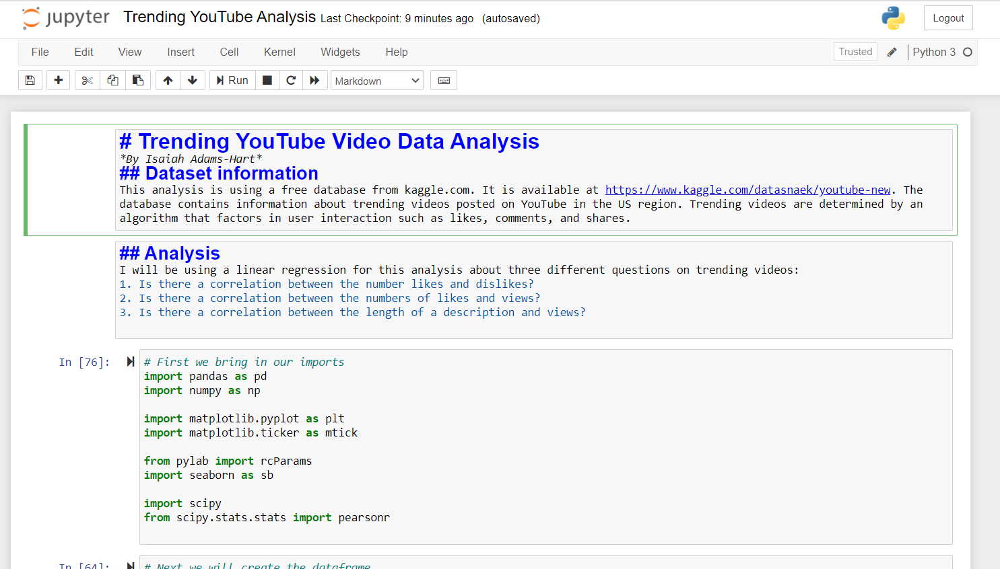

# Overview
This analysis uses PearsonsR correlation coefficient and linear regression to determine if there is a correlation between likes and dislikes, likes and views, and the length of a description and views. This is my first data analysis using pandas via jupyter lab.

# Development Environment
* Anaconda
* Pandas
* Jupyter Lab
* Python 3.8.5

# Execution
Download Python and Anaconda. Open the Anaconda terminal and type in 'Jupyter Notebook'. From there you can use Jupyter to navigate to your downloaded files and open the file from there.
Preview image of analysis:

# Useful Websites

1. [Python Information](https://docs.python.org/3/library/index.html)
2. [Where I got the dataset](https://www.kaggle.com/datasnaek/youtube-new)
3. [Pandas Documentation](https://pandas.pydata.org/docs/)
4. [Anacondas Info](https://www.anaconda.com/products/individual)
5. [Jupyter](https://jupyter.readthedocs.io/en/latest/)
